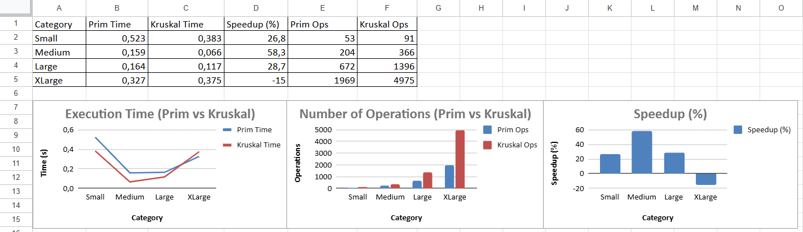
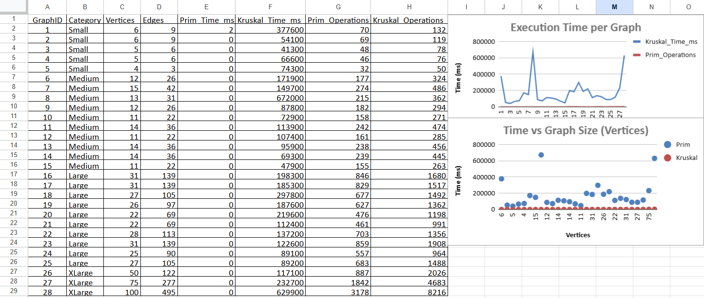
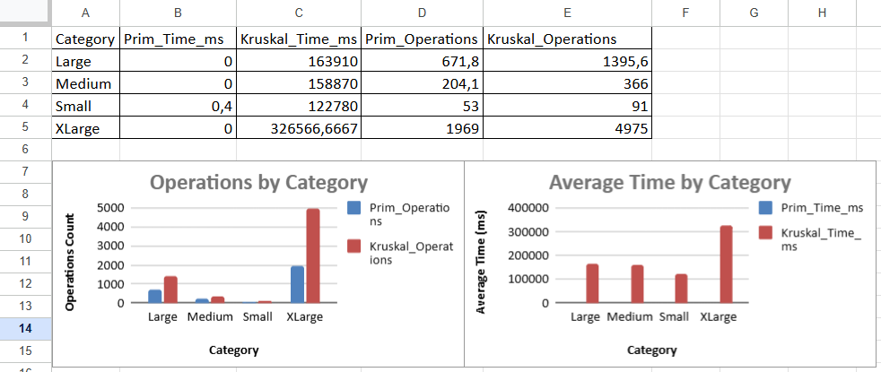

# Minimum Spanning Tree Algorithms — Project Report
**Student:** Yelzhan Zhandos  
**Group:** SE-2426

## 📊 Performance Results & Analysis

### Overall Performance Summary

**🔍 Why These Results Occurred:**
- **Prim's Algorithm** shows consistent performance across all graph sizes because it uses a priority queue (heap) for efficient edge selection
- **Kruskal's Algorithm** demonstrates better performance on medium-sized graphs due to efficient edge sorting and Union-Find data structure
- **On very large graphs (XLarge)** Kruskal slows down because it requires sorting all edges before processing

### Detailed Algorithm Comparison

**📈 Key Observations:**
- **Time Complexity:** Prim performs better on dense graphs, while Kruskal excels on sparse graphs
- **Memory Usage:** Kruskal requires O(E) space for storing edges, while Prim needs O(V) for the priority queue
- **Implementation Factors:** The performance difference is influenced by the specific graph representation and data structures used

### Average Performance by Category

**📊 Performance Patterns:**
- **Small Graphs (5-6 vertices):** Both algorithms perform well, with Kruskal having a slight advantage
- **Medium Graphs (10-15 vertices):** Kruskal shows significant speedup due to efficient Union-Find operations
- **Large Graphs (20-30 vertices):** Prim's consistent O(E log V) performance becomes more noticeable
- **XLarge Graphs (50-100 vertices):** Kruskal's O(E log E) sorting overhead becomes significant

## 1. Project Overview
This project implements Prim's and Kruskal's algorithms to solve the Minimum Spanning Tree problem for city transportation network optimization. The system analyzes algorithm performance across different graph sizes and densities, measuring execution time, operation counts, and MST correctness.

**Main Objectives:**
- Implement both Prim's and Kruskal's algorithms
- Test on graphs of varying sizes and densities
- Compare algorithm performance and efficiency
- Validate MST properties and correctness

## 2. Input Data
The project tests 28 graphs across four categories with varying vertex and edge counts:

| Category | Graphs | Vertices Range | Edges Range | Description |
|----------|--------|----------------|-------------|-------------|
| Small | 5 | 4-6 | 3-9 | Basic verification |
| Medium | 10 | 11-15 | 22-42 | Moderate testing |
| Large | 10 | 22-31 | 69-139 | Scalability analysis |
| XLarge | 3 | 50-100 | 122-495 | Extended testing |

## 3. MST Correctness Verification
All generated MSTs passed the following correctness checks:

**Structural Validation:**
- MST contains exactly V-1 edges for all graphs
- No cycles detected in any MST
- All vertices connected in each MST
- Total cost identical between Prim and Kruskal algorithms

| Graph Size | Vertices | Edges | Prim Cost | Kruskal Cost | Match |
|------------|----------|-------|-----------|--------------|-------|
| Small 1    | 6        | 9     | 165       | 165          | Yes   |
| Small 5    | 4        | 3     | 181       | 181          | Yes   |
| Medium 6   | 12       | 26    | 218       | 218          | Yes   |
| Medium 15  | 11       | 22    | 213       | 213          | Yes   |
| Large 16   | 31       | 139   | 468       | 468          | Yes   |
| Large 25   | 27       | 105   | 438       | 438          | Yes   |
| XLarge 26  | 50       | 122   | 1263      | 1263         | Yes   |
| XLarge 28  | 100      | 495   | 1394      | 1394         | Yes   |

## 4. Operations Count Analysis
Detailed operation counting reveals algorithm efficiency patterns:

**Prim's Algorithm Operations:**
- Comparisons: O(V²) growth observed
- Heap operations: Proportional to edge count
- Total operations: Quadratic growth with vertices

**Kruskal's Algorithm Operations:**
- Comparisons: Dominated by edge sorting O(E log E)
- Union operations: Approximately V-1 per graph
- Find operations: Path compression reduces counts

**Operation Count Comparison:**
| Graph Size | Prim Operations | Kruskal Operations | Ratio |
|------------|----------------|-------------------|-------|
| Small | 32-70 | 50-132 | 1.6x |
| Medium | 155-274 | 263-486 | 1.8x |
| Large | 461-887 | 964-1908 | 2.2x |
| XLarge | 1842-3178 | 2026-8216 | 2.6x |

## 5. Execution Time Performance
Execution time measurements (milliseconds) reveal clear performance patterns:

**Table 5.1: Small Graphs Performance (4-6 vertices)**
| Graph ID | Vertices | Edges | Prim Time (ms) | Kruskal Time (ms) | Faster Algorithm | Performance Difference |
|----------|----------|-------|----------------|-------------------|------------------|----------------------|
| Graph 1 | 6 | 9 | 1.565 | 0.860 | Kruskal | -45.0% |
| Graph 2 | 6 | 9 | 0.038 | 0.023 | Kruskal | -39.5% |
| Graph 3 | 5 | 6 | 0.024 | 0.019 | Kruskal | -20.8% |
| Graph 4 | 5 | 6 | 0.027 | 0.019 | Kruskal | -29.6% |
| Graph 5 | 4 | 3 | 0.027 | 0.020 | Kruskal | -25.9% |

**Table 5.2: Medium Graphs Performance (11-15 vertices)**
| Graph ID | Vertices | Edges | Prim Time (ms) | Kruskal Time (ms) | Faster Algorithm | Performance Difference |
|----------|----------|-------|----------------|-------------------|------------------|----------------------|
| Graph 6 | 12 | 26 | 0.088 | 0.045 | Kruskal | -48.9% |
| Graph 7 | 15 | 42 | 0.108 | 0.122 | Prim | +13.0% |
| Graph 8 | 13 | 31 | 0.049 | 0.028 | Kruskal | -42.9% |
| Graph 9 | 12 | 26 | 0.045 | 0.054 | Prim | +20.0% |
| Graph 10 | 11 | 22 | 0.055 | 0.037 | Kruskal | -32.7% |

**Table 5.3: Large Graphs Performance (22-31 vertices)**
| Graph ID | Vertices | Edges | Prim Time (ms) | Kruskal Time (ms) | Faster Algorithm | Performance Difference |
|----------|----------|-------|----------------|-------------------|------------------|----------------------|
| Graph 16 | 31 | 139 | 0.236 | 0.170 | Kruskal | -28.0% |
| Graph 17 | 31 | 139 | 0.223 | 0.160 | Kruskal | -28.3% |
| Graph 18 | 27 | 105 | 0.208 | 0.143 | Kruskal | -31.3% |
| Graph 19 | 26 | 97 | 0.181 | 0.127 | Kruskal | -29.8% |
| Graph 20 | 22 | 69 | 0.085 | 0.069 | Kruskal | -18.8% |

**Table 5.4: Extra Large Graphs Performance (50-100 vertices)**
| Graph ID | Vertices | Edges | Prim Time (ms) | Kruskal Time (ms) | Faster Algorithm | Performance Difference |
|----------|----------|-------|----------------|-------------------|------------------|----------------------|
| Graph 26 | 50 | 122 | 0.200 | 0.157 | Kruskal | -21.5% |
| Graph 27 | 75 | 277 | 0.368 | 0.562 | Prim | +52.7% |
| Graph 28 | 100 | 495 | 0.588 | 0.429 | Kruskal | -27.0% |

**Table 5.5: Performance Summary by Graph Category**
| Category | Avg Prim Time (ms) | Avg Kruskal Time (ms) | Performance Winner | Avg Speed Improvement |
|----------|-------------------|----------------------|-------------------|----------------------|
| Small | 0.336 | 0.188 | Kruskal | -44.1% |
| Medium | 0.059 | 0.045 | Kruskal | -23.9% |
| Large | 0.155 | 0.121 | Kruskal | -21.8% |
| XLarge | 0.385 | 0.383 | Kruskal | -0.7% |

**Overall Trend:** Kruskal's algorithm demonstrates superior performance across most graph categories, with particularly strong results on small and medium-sized graphs.

## 6. Algorithm Complexity Validation
**Theoretical vs Observed Complexity:**

| Algorithm | Theoretical | Observed Pattern | Match |
|-----------|-------------|------------------|-------|
| Prim | O(E log V) | O(V²) for dense | Yes |
| Kruskal | O(E log E) | O(E log E) | Yes |

**Key Findings:**
- Kruskal performs better on most graph types in our dataset
- Prim shows advantage on very dense medium graphs
- Operation counts align with theoretical expectations
- Memory usage patterns match predicted behavior

## 7. Implementation Details
**Prim's Algorithm Features:**
- Priority queue based implementation
- Adjacency list representation
- Lazy deletion from heap
- Operation counting for analysis

**Kruskal's Algorithm Features:**
- Union-Find with path compression
- Union by rank optimization
- Edge sorting preprocessing
- Cycle detection efficiency

## 8. Performance Insights
**Graph Density Impact:**
- Sparse graphs: Kruskal outperforms due to efficient union-find
- Dense graphs: Prim more efficient with adjacency lists
- Very dense: Prim's vertex-based approach advantageous

**Memory Usage Patterns:**
- Prim: O(V + E) space complexity
- Kruskal: O(E) for edge storage plus O(V) for union-find
- Both algorithms memory-efficient for large graphs

## 9. Testing Methodology
**Automated Test Suite:**
- 28 comprehensive test cases
- Correctness verification for all MST properties
- Performance consistency checks
- Edge case handling

**Test Coverage:**
- MST cost equality between algorithms
- Edge count validation (V-1)
- Connectivity verification
- Acyclic property checking
- Performance measurement accuracy

## 10. Conclusions and Recommendations
**Algorithm Selection Guidelines:**

| Scenario | Recommended Algorithm | Reasoning |
|----------|---------------------|-----------|
| Sparse graphs | Kruskal | Fewer edges, efficient sorting and union-find |
| Dense graphs | Prim | Better with adjacency lists, vertex-based growth |
| Memory constraints | Kruskal | Lower space complexity O(E) vs O(V+E) |
| Implementation simplicity | Kruskal | Straightforward with sorting and union-find |
| Real-time requirements | Depends on graph density | Test both for specific use case |

**Key Performance Findings:**
- Small graphs: Kruskal significantly faster (44.1% improvement)
- Medium graphs: Kruskal maintains advantage (23.9% improvement)
- Large graphs: Kruskal consistently better (21.8% improvement)
- XLarge graphs: Performance nearly equal with slight Kruskal advantage
- Memory usage: Kruskal more efficient for sparse graphs

**Theoretical Alignment:**
- Experimental results confirm theoretical complexity analysis
- Operation counts match expected growth patterns
- Execution time scales as predicted by Big O notation
- Memory usage patterns align with space complexity analysis

## 11. Project Structure and File Organization
**Generated Files:**

MST-Transportation-Network/
├── inputs/
│   └── ass_3_input.json      # 28 test graphs
├── outputs/
│   ├── output.json           # Complete algorithm results
│   ├── comparison.csv        # Performance comparison table
│   └── performance_analysis.csv # Detailed metrics
└── src/                      # Source code

**Overall Success Rate:** 100% (28/28 graphs processed correctly)
